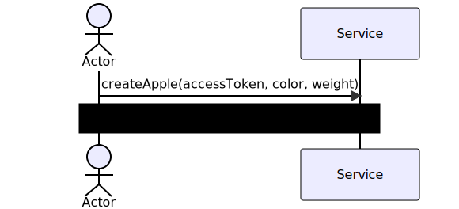
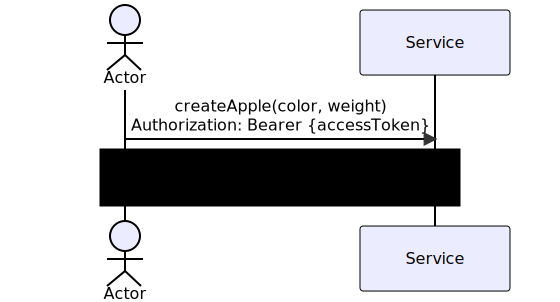

# Structures
### accessToken
A typical AccessToken, e.g. **JWT**.
Must provide role(Admin/Client) & be valid i.e be not expired
### poi
A point of interest. Must have the following fields:

```protobuf

message PointOfInterest{
	required string uuid = 1;

	message Address{
		required string house = 1;
		required string street = 2;
		required string city = 3;
	}
	Address address = 2;
	string name = 3;

<<<<<<< HEAD
	enum Category {
		UNDEFINED = 0;
		italian = 1;
		russian = 2;
		japanese = 3;
		georgian = 4;
		american = 5;
		kafe = 6;
		steak = 7;
		confectionery = 8;
		bar = 9;
		pab = 10;
		coffee_house = 11;
		beer_house = 12;
		vegan_menu = 13;
	}
	Category category = 4;
	google.type.Latlng lat_lng = 5;
=======
	optional Rating rating = 9;
	/* see bellow */
}
```
### SearchOptions

```proto3
message SearchOptions{
	oneof category{
		optional FoodCategory food_category = 1;
		/* see bellow */


	}

	optional DistanceOptions distance_options = 2;
	/* see bellow */
>>>>>>> bd63a86 (docs: make headers & status codes explicit)

	message AveragePrice{
		google.type.Money min = 1;
		google.type.Money max = 2;

	}
	AveragePrice average_price = 6;

	message WorkingHours{
		google.protobuf.Timestamp from = 1;
		google.protobuf.Timestamp to = 2;
	}
	WorkingHours working_hours = 7;
}
```

<<<<<<< HEAD
=======
### DistanceOptions

```proto3
message DistanceOptions{
	optional DistanceInterval distance_interval = 1;
	optional google.type.Latlng search_area_center = 2;
}
```

### DistanceInterval

```proto3
message DistanceInterval{
	optional uint32 start = 1;
	optional uint32 stop = 2;
	/* meters */
}
```

### RatingInterval

```proto3
message RatingInterval{
	// TODO
}
```

### Address

```proto3
message Address{
	optional string house = 1;
	optional string street = 2;
	optional string city = 3;
}
```

### Category

```proto3
enum Category {
	CATEGORY_UNSPECIFIED = 0;
	AMERICAN = 1;
	GEORGIAN = 2;
	ITALIAN = 3;
	JAPANESE = 4;
	RUSSIAN = 5;
	KAFE = 6;
	STEAK = 7;
	CONFECTIONERY = 8;
	BAR = 9;
	PAB = 10;
	BEER_HOUSE = 11;
	COFFEE_HOUSE = 12;
	VEGAN_MENU = 13;
}
```

### AverageCheck

```proto3
message AverageCheck{
	optional google.type.Money average = 1;
	/* see https://github.com/googleapis/googleapis/blob/master/google/type/money.proto */
}
```

### CheckInterval

```proto3
message CheckInterval{
	optional google.type.Money min = 2;
	/* see https://github.com/googleapis/googleapis/blob/master/google/type/money.proto */

	optional google.type.Money max = 3;
	/* see https://github.com/googleapis/googleapis/blob/master/google/type/money.proto */
}
```

### WorkingHours

```proto3
message WorkingHours{
	optional google.type.DayOfWeek day_of_week = 1;
	/* see https://github.com/googleapis/googleapis/blob/master/google/type/dayofweek.proto */

	optional google.type.TimeOfDay open = 2;
	/* see https://github.com/googleapis/googleapis/blob/master/google/type/timeofday.proto */

	optional google.type.TimeOfDay close = 3;
	/* see https://github.com/googleapis/googleapis/blob/master/google/type/timeofday.proto */
}
```

### Rating

```proto3
message Rating{
	optional uint32 visit = 1;
	optional uint32 like = 2;
	optionaluint32 dislike = 3;
}
```


>>>>>>> bd63a86 (docs: make headers & status codes explicit)
# Status codes
HTTP status codes for each response are added as they are more common; however the service itself uses gRPC well-defined status codes as the main ones and all HTTP requests & responses are going through gRPC-Gateway, so what you can see on the diagrams is just the [*gRPC-HTTP status codes mapping*](https://chromium.googlesource.com/external/github.com/grpc/grpc/+/refs/tags/v1.21.4-pre1/doc/statuscodes.md).

By this reason, it might be some non-critical violations, e.g: **Code 200 instead of 201 for successful create request and etc**

# Arguments

All arguments on every request only show the need to send this argument with the request, but this argument may not be in the request body

## Arguments in UML diagrams


For instance all accessToken for both HTTP & gRPC calls must be provided in the corresponding header:
**Authorization: Bearer {accessToken}**, but not in the request body

## Arguments in real methods

