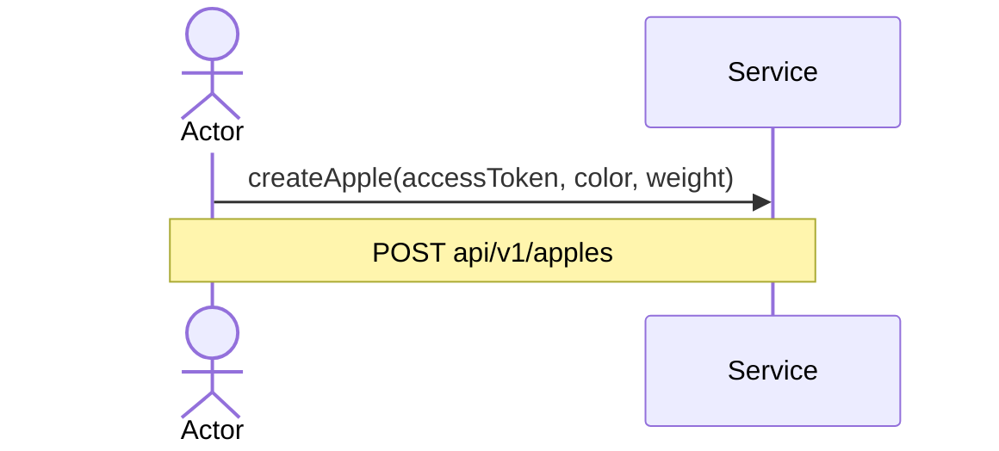
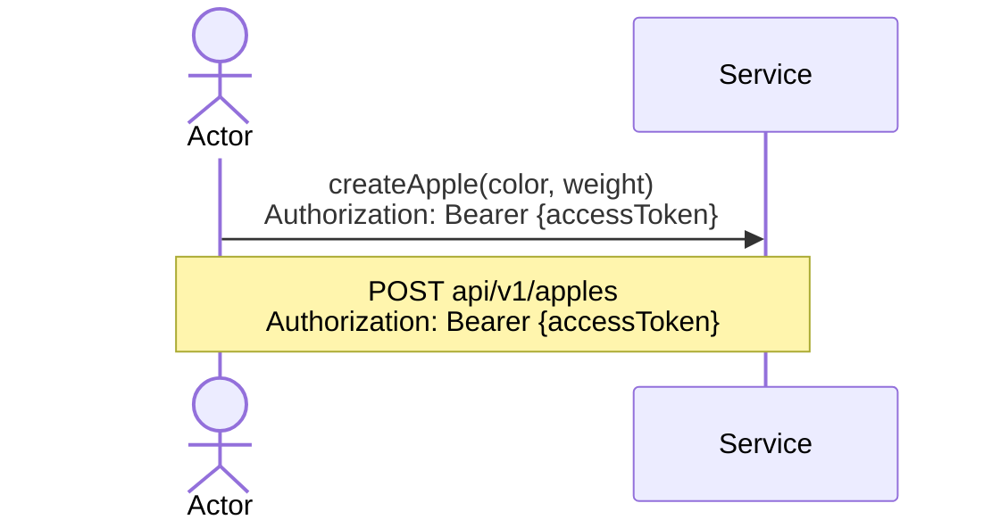

# Structures
### accessToken
A typical AccessToken, e.g. **JWT**.
Must provide role(Admin/Client) & be valid i.e be not expired
### poi
A point of interest. Must have the following fields:

```protobuf

message PointOfInterest{
	required string uuid = 1;

	message Address{
		required string house = 1;
		required string street = 2;
		required string city = 3;
	}
	Address address = 2;
	string name = 3;

	enum Category {
		UNDEFINED = 0;
		italian = 1;
		russian = 2;
		japanese = 3;
		georgian = 4;
		american = 5;
		kafe = 6;
		steak = 7;
		confectionery = 8;
		bar = 9;
		pab = 10;
		coffee_house = 11;
		beer_house = 12;
		vegan_menu = 13;
	}
	Category category = 4;
	google.type.Latlng lat_lng = 5;

	message AveragePrice{
		google.type.Money min = 1;
		google.type.Money max = 2;

	}
	AveragePrice average_price = 6;

	message WorkingHours{
		google.protobuf.Timestamp from = 1;
		google.protobuf.Timestamp to = 2;
	}
	WorkingHours working_hours = 7;
}
```

# Status codes
HTTP status codes for each response are added as they are more common; however the service itself uses gRPC well-defined status codes as the main ones and all HTTP requests & responses are going through gRPC-Gateway, so what you can see on the diagrams is just the [*gRPC-HTTP status codes mapping*](https://chromium.googlesource.com/external/github.com/grpc/grpc/+/refs/tags/v1.21.4-pre1/doc/statuscodes.md).

By this reason, it might be some non-critical violations, e.g: **Code 200 instead of 201 for successful create request and etc**

# Arguments

All arguments on every request only show the need to send this argument with the request, but this argument may not be in the request body

## Arguments in UML diagrams


For instance all accessToken for both HTTP & gRPC calls must be provided in the corresponding header:
**Authorization: Bearer {accessToken}**, but not in the request body

## Arguments in real methods

