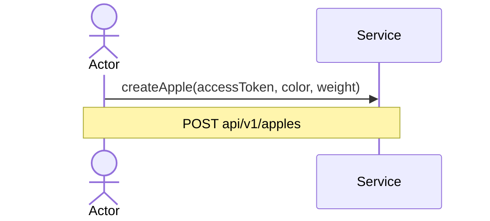
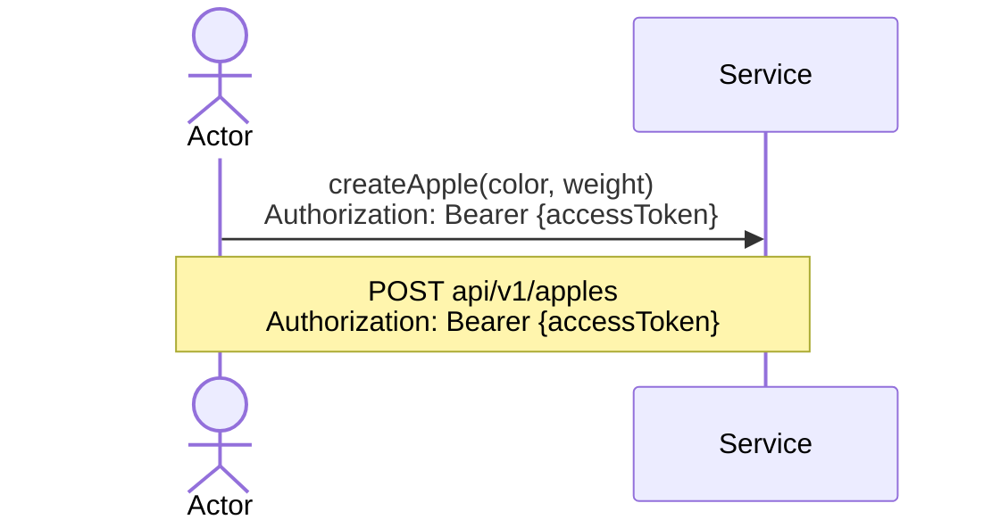

<<<<<<< HEAD
=======
# Structures
### accessToken
A typical AccessToken, e.g. **JWT**.
Must provide role(Admin/Client) & be valid i.e be not expired
### PointOfInterest
A point of interest. Must have the following fields:

>>>>>>> 70baf8d (docs: bring out all custom structs to global scope)
```protobuf
message PointOfInterest{
	required string uuid = 1;
	Address address = 2;
	/* see bellow */

	string name = 3;
	Category category = 4;
	/* see bellow */

	google.type.Latlng lat_lng = 5;
	/* see https://github.com/googleapis/googleapis/blob/master/google/type/latlng.proto */

	oneof Check{
		AverageCheck average_check = 6;
		/* see bellow */

		BoundedCheck bounded_check = 7;
		/* see bellow */
	}
	repeated WorkingHours working_hours = 8;
	/* see bellow */

	Rating rating = 9;
	/* see bellow */
}
<<<<<<< HEAD
```
=======
```

### Address

```protobuf
message Address{
	required string house = 1;
	required string street = 2;
	required string city = 3;
}
```

### Category

```protobuf
enum Category {
	CATEGORY_UNSPECIFIED = 0;
	ITALIAN = 1;
	RUSSIAN = 2;
	JAPANESE = 3;
	GEORGIAN = 4;
	AMERICAN = 5;
	KAFE = 6;
	STEAK = 7;
	CONFECTIONERY = 8;
	BAR = 9;
	PAB = 10;
	COFFEE_HOUSE = 11;
	BEER_HOUSE = 12;
	VEGAN_MENU = 13;
}
```

### AverageCheck

```protobuf
message AverageCheck{
	google.type.Money average = 1;
	/* see https://github.com/googleapis/googleapis/blob/master/google/type/money.proto */
}
```

### BoundedCheck

```protobuf
message BoundedCheck{
	optional google.type.Money min = 2;
	/* see https://github.com/googleapis/googleapis/blob/master/google/type/money.proto */

	optional google.type.Money max = 3;
	/* see https://github.com/googleapis/googleapis/blob/master/google/type/money.proto */
}
```

### WorkingHours

```protobuf
message WorkingHours{
	google.type.DayOfWeek day_of_week = 1;
	/* see https://github.com/googleapis/googleapis/blob/master/google/type/dayofweek.proto */

	google.type.TimeOfDay open = 2;
	/* see https://github.com/googleapis/googleapis/blob/master/google/type/timeofday.proto */

	google.type.TimeOfDay close = 3;
	/* see https://github.com/googleapis/googleapis/blob/master/google/type/timeofday.proto */
}
```

### Rating

```protobuf
message Rating{
	uint32 like = 1;
	uint32 dislike = 2;
}
```


# Status codes
HTTP status codes for each response are added as they are more common; however the service itself uses gRPC well-defined status codes as the main ones and all HTTP requests & responses are going through gRPC-Gateway, so what you can see on the diagrams is just the [*gRPC-HTTP status codes mapping*](https://chromium.googlesource.com/external/github.com/grpc/grpc/+/refs/tags/v1.21.4-pre1/doc/statuscodes.md).

By this reason, it might be some non-critical violations, e.g: **Code 200 instead of 201 for successful create request and etc**

# Arguments

All arguments on every request only show the need to send this argument with the request, but this argument may not be in the request body

## Arguments in UML diagrams


For instance all accessToken for both HTTP & gRPC calls must be provided in the corresponding header:
**Authorization: Bearer {accessToken}**, but not in the request body

## Arguments in real methods

>>>>>>> 70baf8d (docs: bring out all custom structs to global scope)
